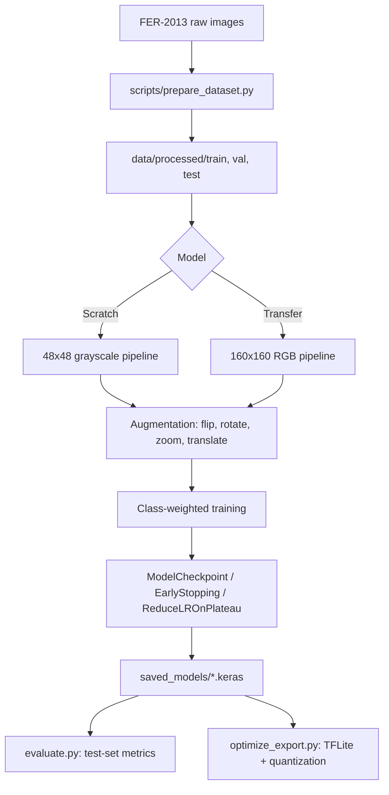
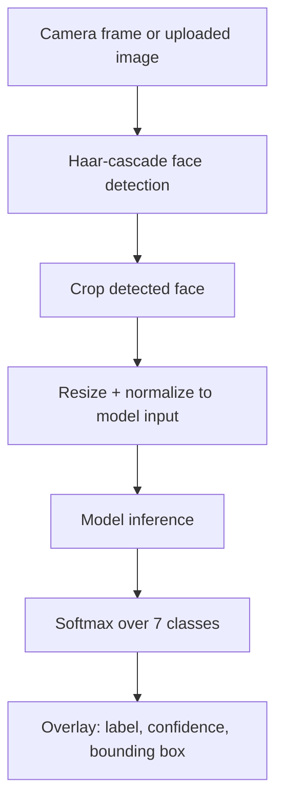

<div align="center">

# DeepFER

Facial emotion recognition on FER-2013 using a from-scratch CNN and a fine-tuned MobileNetV2 transfer-learning model, with real-time inference, a web application, and post-training quantization for deployment.


</div>

---

## Overview

DeepFER classifies a face image into one of seven emotions — angry, disgust, fear, happy, neutral, sad, surprise — using two independently trained models built and evaluated under identical conditions:

- A **convolutional network built from scratch** (617,511 parameters), designed specifically for FER-2013's native 48×48 grayscale format, with L2 regularization and dropout tuned for a small, imbalanced dataset.
- A **MobileNetV2 backbone pretrained on ImageNet**, fine-tuned in two phases and run at 160×160 input resolution — a value chosen empirically after comparing 96×96, 160×160, and MobileNetV2's native 224×224.

Both models are trained on FER-2013, evaluated on its held-out 7,178-image test partition, and shipped with real-time inference (desktop OpenCV and a browser-based Flask application), plus a TFLite export pipeline with measured post-training quantization.

This repository is intended for anyone who wants a working, rigorously-benchmarked FER baseline — the training pipeline, evaluation methodology, and every reported number are reproducible directly from the code.

### Key capabilities

- Two complete, independently trained classifiers with a documented accuracy/complexity trade-off
- Balanced class weighting to address FER-2013's severe class imbalance
- Two-phase transfer learning (frozen-backbone feature extraction, then partial fine-tuning)
- Input resolution and regularization choices validated by direct, matched-condition comparison
- Real-time webcam inference via OpenCV Haar-cascade face detection
- A Flask web application supporting both photo upload and live in-browser camera inference
- TFLite conversion with float32, dynamic-range int8, and full int8 quantization, each benchmarked for accuracy, latency, and size
- Full evaluation artifacts: per-class precision/recall/F1, confusion matrices, and training curves, checked into the repository

---

## Features

| Feature | Description |
|---|---|
| From-scratch CNN | 4-block convolutional network (32→64→128→256 filters), L2-regularized, GlobalAveragePooling2D head, 617,511 parameters, trained natively on 48×48 grayscale input |
| Transfer learning | MobileNetV2 backbone pretrained on ImageNet, fine-tuned at 160×160 RGB in two phases |
| Class-balanced training | Balanced class weights computed from on-disk file counts, applied via Keras' `class_weight` |
| Data augmentation | Random horizontal flip, rotation (±~36°), zoom (±15%), and translation (±10%), applied to the training split only |
| Real-time webcam inference | Haar-cascade face detection, per-frame classification, bounding box and confidence overlay, rolling FPS counter |
| Web application | Flask app supporting photo upload and live `getUserMedia` browser camera inference, with a consistent per-emotion color system throughout the interface |
| Model optimization | TFLite conversion with float32, dynamic-range int8, and full int8 quantization; accuracy and latency measured per variant |
| Checkpointed, resumable training | Per-epoch checkpointing with a `--resume` flag, for training in bounded sessions without losing progress |
| Quantitative evaluation | Accuracy, macro/weighted precision, recall, F1, and per-class breakdown on the untouched test set |
| Reproducible artifacts | Training curves, confusion matrices, and metrics JSON checked into `outputs/` |

---

## Architecture

### Training pipeline



### Transfer learning: two-phase strategy

```mermaid
flowchart LR
    A[MobileNetV2, ImageNet weights] --> B[Phase 1: Head training]
    B -->|Backbone frozen| C[GlobalAveragePooling2D]
    C --> D[Dense 256, ReLU]
    D --> E[Dropout 0.4]
    E --> F[Dense 7, softmax]
    F --> G[transfer_head_best.keras]
    G --> H[Phase 2: Fine-tuning]
    H -->|Top 30 layers unfrozen, lr = 1e-5| I[transfer_finetune_best.keras]
```



### Inference pipeline (real-time / web)



---

## Repository structure

```
Facial-Recognition-System/
├── deepfer/                       Core package
│   ├── config.py                  Single source of truth: paths, classes, hyperparameters
│   ├── dataset.py                 tf.data pipelines, augmentation, class-weight computation
│   ├── metrics_utils.py           Shared evaluation, plotting, and metrics-saving helpers
│   └── models/
│       ├── cnn_scratch.py         From-scratch CNN architecture
│       └── transfer_model.py      MobileNetV2 transfer-learning architecture
├── scripts/
│   ├── prepare_dataset.py         Builds data/processed/{train,val,test} from raw FER-2013
│   └── download_pretrained_weights.py
├── webapp/
│   ├── app.py                     Flask application
│   ├── templates/
│   │   └── index.html
│   └── static/
│       ├── style.css
│       └── app.js
├── tests/
│   └── test_pipeline.py           End-to-end pipeline test (detection → classification → overlay)
├── sample_images/                 Reference images, one per emotion class
├── saved_models/                  Trained checkpoints and exported TFLite models (not tracked in git)
├── outputs/
│   ├── metrics/                   Test-set metrics, optimization results (JSON)
│   ├── plots/                     Confusion matrices, training curves (PNG)
│   └── logs/                      Training history CSVs
├── train.py                       Trains the from-scratch CNN
├── train_transfer.py              Trains the MobileNetV2 transfer model (head / finetune phases)
├── evaluate.py                    Evaluates a checkpoint on the held-out test set
├── optimize_export.py             Converts a checkpoint to TFLite with quantization, benchmarks all variants
├── realtime_webcam.py             Desktop real-time inference (OpenCV)
├── requirements.txt
└── deepfer/config.py
```

---

## Dataset

[FER-2013](https://www.kaggle.com/datasets/msambare/fer2013): 35,887 grayscale facial images at 48×48 resolution, labeled into 7 emotion classes.

| Split | Angry | Disgust | Fear | Happy | Neutral | Sad | Surprise | Total |
|---|---|---|---|---|---|---|---|---|
| Train | 3,595 | 392 | 3,687 | 6,493 | 4,469 | 4,347 | 2,854 | 25,837 |
| Validation | 400 | 44 | 410 | 722 | 496 | 483 | 317 | 2,872 |
| Test | 958 | 111 | 1,024 | 1,774 | 1,233 | 1,247 | 831 | 7,178 |

The validation split is a stratified 10% carve-out of the original training partition. The test partition is never touched during training or model selection. The dataset is not checked into this repository; `scripts/prepare_dataset.py` builds `data/processed/` from a local copy of the raw FER-2013 archive.

FER-2013 is heavily imbalanced — `happy` has roughly 16.6× as many training images as `disgust`. This is corrected with balanced class weights (`w_i = N / (n_classes × n_i)`, computed from on-disk file counts) applied through Keras' `class_weight` argument during training of both models.

---

## Models

### From-scratch CNN

Four convolutional blocks of increasing width (32 → 64 → 128 → 256 filters). Blocks 1–3 stack two 3×3 convolutions each; block 4 uses one. Every convolution is followed by BatchNormalization and ReLU, with L2 weight regularization (λ=1e-4) throughout. Dropout(0.25) sits between blocks 2–3 and 3–4. The classification head uses `GlobalAveragePooling2D` rather than `Flatten`, followed by `Dense(128, ReLU)`, `Dropout(0.5)`, and a 7-way softmax.

| | |
|---|---|
| Input | 48×48, grayscale |
| Parameters | 617,511 |
| Regularization | L2 (1e-4) + Dropout (0.25, 0.5) |
| Test accuracy | 52.27% |

### MobileNetV2 transfer learning

MobileNetV2 pretrained on ImageNet (2.26M backbone parameters), with grayscale input replicated to 3 channels and resized to 160×160 — the strongest accuracy/compute trade-off among the resolutions evaluated.

| Phase | Trainable | Learning rate | Epochs run |
|---|---|---|---|
| Head (backbone frozen) | 329,735 | 1e-3 | 15 |
| Fine-tune (top 30 backbone layers unfrozen) | 1,840,455 | 1e-5 | 60 |

BatchNormalization layers within the unfrozen region are kept frozen (running statistics not updated) during fine-tuning, to avoid instability from small, class-imbalanced batches.

**Resolution and label smoothing were both validated empirically**, not assumed. 96×96 reached 49.6% test accuracy; 160×160 reached the final 59.46%; MobileNetV2's native 224×224 was also tested and underperformed 160×160 under a comparable training budget, consistent with FER-2013's native 48×48 source resolution limiting the benefit of further upsampling. Label smoothing (ε=0.1) was tested against standard cross-entropy and underperformed by roughly 2.6 validation points, so standard cross-entropy was kept.

---

## Results

Evaluated once each on the untouched 7,178-image test partition:

| Model | Accuracy | Macro Precision | Macro Recall | Macro F1 | Weighted F1 |
|---|---|---|---|---|---|
| Scratch CNN | 52.27% | 44.73% | 51.11% | 45.73% | 50.89% |
| Transfer, fine-tuned (160×160) | **59.46%** | 57.48% | 58.10% | 57.07% | 58.46% |

### Per-class F1

| Class | Support | Scratch F1 | Transfer F1 |
|---|---|---|---|
| Angry | 958 | 0.322 | 0.503 |
| Disgust | 111 | 0.298 | 0.609 |
| Fear | 1,024 | 0.195 | 0.318 |
| Happy | 1,774 | 0.796 | 0.812 |
| Neutral | 1,233 | 0.521 | 0.563 |
| Sad | 1,247 | 0.408 | 0.476 |
| Surprise | 831 | 0.662 | 0.714 |

Both models are strongest on `happy` and `surprise`, and weakest on `fear`. Fear has more training images than disgust, surprise, or angry, so this is not a data-scarcity artifact — it reflects genuine visual overlap between fear, sad, and angry in FER-2013, a documented property of the dataset (estimated human-rater agreement on FER-2013 is only 65–68%). The transfer model improves over the scratch model on every class, most notably on `disgust` (0.298 → 0.609) despite that class having only 392 training images.

Full metrics, including per-class precision/recall and confusion matrices, are in `outputs/metrics/` and `outputs/plots/`.

---

## Deployment optimization

`optimize_export.py` converts each trained model to TFLite and benchmarks float32, dynamic-range int8, and full int8 quantization — real measured latency (100-run average) and real accuracy (2,000-image seeded subset).

### Transfer model (fine-tuned, 160×160)

| Variant | Accuracy | Latency | Speedup | Size |
|---|---|---|---|---|
| Keras baseline (float32) | 58.35% | 63.82 ms | 1.0× | 10.35 MB |
| TFLite float32 | 58.35% | 8.27 ms | 7.7× | 10.21 MB |
| TFLite dynamic-range int8 | **58.50%** | 17.28 ms | 3.7× | 2.87 MB (−72%) |
| **TFLite full int8** | 56.35% | **1.90 ms** | **33.5×** | **3.08 MB (−70%)** |

### Scratch CNN

| Variant | Accuracy | Latency | Speedup | Size |
|---|---|---|---|---|
| Keras baseline (float32) | 50.35% | 55.43 ms | 1.0× | 2.47 MB |
| TFLite float32 | 50.35% | 2.37 ms | 23.4× | 2.47 MB |
| TFLite dynamic-range int8 | 50.60% | 0.59 ms | 94.3× | 0.64 MB (−74%) |
| TFLite full int8 | 50.35% | 0.51 ms | 108.3× | 0.65 MB (−74%) |

For the transfer model, full int8 gives the largest speedup and size reduction at a 2.0-point accuracy cost; dynamic-range int8 slightly *exceeds* float32 accuracy on this checkpoint while still giving a 72% size reduction, making it the stronger choice when accuracy preservation matters most. For the scratch model, all quantized variants stay within 0.25 points of baseline accuracy while running over 90× faster — full int8 is the clear recommendation there.

---

## Installation

```bash
git clone https://github.com/b4645857-ai/Facial-Emotion-Recognition-System.git
cd Facial-Emotion-Recognition-System
python -m venv venv
source venv/bin/activate        # Windows: venv\Scripts\activate
pip install -r requirements.txt
```

`opencv-python` is pinned to `4.10.0.84` for compatibility with `cv2.CascadeClassifier`, used by the face-detection path.

### Dataset setup

Download FER-2013 (e.g. from Kaggle) and build the processed splits:

```bash
python scripts/prepare_dataset.py --raw-dir /path/to/fer2013 --out-dir data/processed --val-fraction 0.1 --seed 42
```

---

## Usage

### Train

```bash
# From-scratch CNN
python train.py --epochs 40

# Transfer learning — head phase, then fine-tune phase
python train_transfer.py --phase head --epochs 15
python train_transfer.py --phase finetune --epochs 60
```

Training supports `--resume` (continues from the last checkpoint and training-history log) and `--max-seconds` (stops cleanly after a wall-clock budget), for training across multiple bounded sessions without losing progress.

### Evaluate

```bash
python evaluate.py --checkpoint saved_models/scratch_best.keras --kind scratch --tag scratch
python evaluate.py --checkpoint saved_models/transfer_finetune_best.keras --kind transfer --tag transfer_finetuned
```

### Optimize for deployment

```bash
python optimize_export.py --checkpoint saved_models/transfer_finetune_best.keras --kind transfer --tag transfer_finetuned
```

### Real-time webcam inference

```bash
python realtime_webcam.py --model transfer --checkpoint saved_models/transfer_finetune_best.keras
```

Press `q` to exit. Use `--source path/to/image_or_video` for offline testing instead of a live camera.

### Web application

```bash
python webapp/app.py
```

Open the printed local URL. Supports photo upload and live in-browser camera inference via `getUserMedia`.

### Tests

```bash
pytest tests/
```

---

## Configuration

All paths, class definitions, and hyperparameters are centralized in `deepfer/config.py` — every script imports from this single module, so class ordering and image sizes cannot silently drift between training, evaluation, and inference.

| Setting | Value |
|---|---|
| Classes | `angry, disgust, fear, happy, neutral, sad, surprise` (alphabetical, matches `image_dataset_from_directory` inference) |
| Scratch input | 48×48, grayscale |
| Transfer input | 160×160, RGB |
| Batch size | 64 |
| Scratch learning rate | 1e-3 |
| Transfer head / fine-tune learning rate | 1e-3 / 1e-5 |
| Fine-tune unfrozen layers | Top 30 |
| Augmentation | Horizontal flip, ±10% rotation, ±15% zoom, ±10% translation |
| Seed | 42 |

---


</div>

---


### 🛠️ Tech Stack

**Languages**

`Python` • `Java` • `C` • `JavaScript` • `HTML` • `CSS` • `SQL`

**Frameworks & Libraries**

`TensorFlow` • `Keras` • `OpenCV` • `Flask` • `Bootstrap`

**Tools**

`Git` • `GitHub` • `VS Code` • `Google Colab` • `MySQL`

---


---

<div align="center">

### ⭐ If you found this project helpful, please consider giving it a Star!

**Thank you for visiting my repository ❤️**

**Happy Coding! 🚀**

</div>
